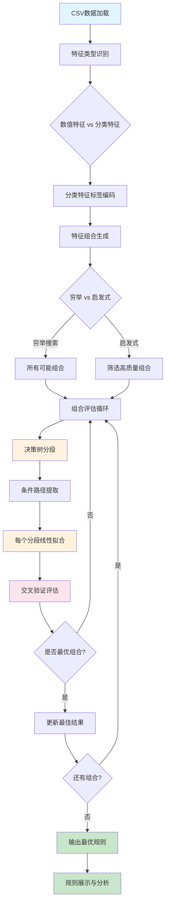

# 优化版条件多项式规则发现工具

一个智能的数据挖掘工具，能够自动发现数据中的**条件多项式规则**，支持数值和分类特征的混合分析。

## 🎯 核心功能

### 什么是条件多项式规则？

简单来说，就是在不同条件下，变量之间存在不同的线性关系。例如：

```
当 temperature <= 25°C 时：energy_cost = 2*area + 1.5*occupancy + 100
当 temperature > 25°C 时：energy_cost = 3*area + 2.0*occupancy + 150

当 product_type = 'A' 且 region ∈ {North, East} 时：sales = 1.2*price + 0.8*marketing + 50
当 product_type ∈ {'B', 'C'} 时：sales = 0.9*price + 1.5*marketing + 80
```

### 为什么需要这个工具？

在现实世界中，变量关系往往不是一成不变的：
- **季节性影响**：夏季和冬季的能耗模式不同
- **产品差异**：不同类型产品的销售规律不同  
- **区域特性**：不同地区的市场行为不同
- **用户分群**：不同用户群体的行为模式不同

传统的全局线性回归无法捕捉这些**分段线性关系**，而我们的工具专门解决这个问题。

## 🔬 技术方案

### 算法原理

我们的方法采用**"分而治之"**的策略：

1. **智能分段**：使用决策树自动发现数据的最佳分段点
2. **局部建模**：在每个分段内拟合线性模型
3. **全局优化**：穷举所有可能的特征组合，找到最优解



### 核心创新

#### 1. 智能特征组合穷举
```python
# 不再只尝试一种特征分配，而是穷举所有可能的组合
for split_size in range(1, min(len(split_candidates), 4) + 1):
    for split_features in combinations(split_candidates, split_size):
        poly_features = [f for f in poly_candidates if f not in split_features]
        # 评估这种组合的效果
```

**优势**：确保找到最优的特征分配，不会错过任何有价值的组合。

### 🌳 决策树分段原理深度解析

#### 为什么用决策树做分段？

传统的手工分段需要人为设定阈值，比如"温度>30°C"或"价格在100-200区间"。但这样做有三个问题：
1. **主观性强** - 阈值设定缺乏数据支撑
2. **维度诅咒** - 多特征组合的阈值设定指数级复杂
3. **局部最优** - 可能错过真正的最佳分段点

决策树通过**信息增益**自动找到最佳分段点，让数据"自己说话"。

#### 核心算法流程

让我们通过代码来看整个过程：

**步骤1：训练决策树模型**
```python
def _evaluate_combination(self, data, split_features, poly_features, target_col):
    # 准备分段特征作为输入
    X_split = data[split_features]  # 例如：temperature, product_type
    y_target = data[target_col]     # 例如：energy_cost
    
    # 训练决策树回归器
    tree_model = DecisionTreeRegressor(
        max_depth=self.max_depth,           # 控制树的深度，防止过拟合
        min_samples_leaf=self.min_samples_leaf,  # 叶子节点最小样本数
        random_state=42                     # 保证结果可重复
    )
    
    tree_model.fit(X_split, y_target)
```

**关键参数解释：**
- `max_depth=3`：限制树的深度，避免过度细分
- `min_samples_leaf=50`：确保每个分段有足够样本，保证统计意义

**步骤2：提取分段条件**
```python
# 获取每个叶子节点的条件路径
conditions_by_leaf = self._extract_tree_conditions(tree_model, split_features, data)
# 获取每个样本所属的叶子节点ID
leaf_ids = tree_model.apply(X_split)
```

**步骤3：从决策树中提取精确条件**

这是最复杂的部分，需要递归遍历决策树：

```python
def _extract_tree_conditions(self, tree_model, feature_names, original_data):
    tree = tree_model.tree_
    conditions_by_leaf = {}
    
    def extract_path(node_id, conditions):
        # 如果是叶子节点，记录到达此处的所有条件
        if tree.children_left[node_id] == -1:  
            conditions_by_leaf[node_id] = conditions.copy()
            return
            
        # 获取当前节点的分裂信息
        feature_idx = tree.feature[node_id]      # 分裂特征的索引
        threshold = tree.threshold[node_id]      # 分裂阈值
        feature_name = feature_names[feature_idx] # 特征名称
        
        # 处理分类特征和数值特征的不同逻辑
        if feature_name in self.categorical_features:
            # 分类特征处理逻辑...
        else:
            # 数值特征：生成 <= 和 > 条件
            left_conditions = conditions + [f"{feature_name} <= {threshold:.2f}"]
            extract_path(tree.children_left[node_id], left_conditions)
            
            right_conditions = conditions + [f"{feature_name} > {threshold:.2f}"]
            extract_path(tree.children_right[node_id], right_conditions)
    
    extract_path(0, [])  # 从根节点开始递归
    return conditions_by_leaf
```

#### 🔍 具体示例：温度-空调类型分段

假设我们有这样的数据：
```python
temperature: [15, 20, 25, 30, 35]
ac_type:     [A,  A,  B,  A,  B]
energy_cost: [100, 120, 200, 180, 250]
```

**决策树学习过程：**

1. **根节点分裂**：算法发现 `temperature <= 27.5` 能最好地分离数据
2. **左分支**：`temperature <= 27.5` 的样本能耗相对较低
3. **右分支**：`temperature > 27.5` 的样本需要进一步按 `ac_type` 分类

最终得到决策树：
```
                  temperature <= 27.5
                      /           \
                    YES            NO
                 [较低能耗]    ac_type ∈ {A}
                               /          \
                             YES          NO
                        [中等能耗A]    [高能耗B]
```

**提取的条件路径：**
- 叶子1：`temperature <= 27.5` 
- 叶子2：`temperature > 27.5 且 ac_type ∈ {A}`
- 叶子3：`temperature > 27.5 且 ac_type ∈ {B}`

#### 🏷️ 分类特征的特殊处理

分类特征（如产品类型、地区）需要特殊处理，因为决策树内部用数值编码：

```python
if feature_name in self.categorical_features:
    # 获取编码器，将数值阈值转换回原始分类值
    le = self.label_encoders[feature_name]
    
    # 根据阈值分组
    left_values = [val for val in unique_encoded_values if val <= threshold]
    right_values = [val for val in unique_encoded_values if val > threshold]
    
    # 转换回原始分类值并格式化
    if left_values:
        left_original = [le.inverse_transform([int(val)])[0] for val in left_values]
        left_condition = f"{feature_name} ∈ {{{', '.join(map(str, left_original))}}}"
```

**举例说明：**
- 原始数据：`product_type = ['A', 'B', 'C']`
- 编码后：`[0, 1, 2]`
- 决策树分裂：`threshold = 1.5`
- 转换回来：
  - 左分支：`product_type ∈ {A, B}` (编码值 ≤ 1.5)
  - 右分支：`product_type ∈ {C}` (编码值 > 1.5)

#### 🎯 分段质量评估

找到分段后，在每个分段内拟合线性模型：

```python
# 对每个叶子节点（分段）
for leaf_id, conditions in conditions_by_leaf.items():
    subset_mask = (leaf_ids == leaf_id)
    subset_data = data[subset_mask]
    
    # 在该分段内拟合多项式模型
    X_poly = subset_data[poly_features]  # 多项式特征
    y_poly = subset_data[target_col]     # 目标变量
    
    # 交叉验证评估拟合质量
    model = LinearRegression()
    cv_scores = cross_val_score(model, X_poly, y_poly, cv=3, scoring='r2')
    avg_score = np.mean(cv_scores)
```

#### 🏆 为什么这种方法有效？

1. **数据驱动**：分段点由数据的内在规律决定，不是人为设定
2. **自动优化**：信息增益确保每次分裂都能最大化目标变量的解释度
3. **多维处理**：可以同时处理多个特征的复杂交互
4. **质量保证**：交叉验证确保分段在新数据上也有效

**对比传统方法：**
| 方法 | 分段方式 | 优点 | 缺点 |
|------|---------|------|------|
| 手工分段 | 经验设定阈值 | 简单直观 | 主观性强，易错过最优点 |
| 聚类分段 | K-means等 | 无监督 | 不考虑目标变量 |
| **决策树分段** | **信息增益优化** | **客观、最优、多维** | **计算复杂度较高** |

这就是为什么我们的工具能够发现传统方法遗漏的复杂分段模式，为业务提供更精确的可解释规则！

### 🔀 多特征分段：处理复杂交互

#### 多特征分段的挑战

当我们有多个特征作为分段条件时，比如 `[temperature, humidity, product_type]`，问题变得复杂：

1. **特征选择**：在每个节点，应该选择哪个特征进行分裂？
2. **阈值优化**：选定特征后，最佳分裂阈值是什么？  
3. **交互发现**：如何捕捉特征之间的交互作用？
4. **维度爆炸**：如何避免过度复杂的分段规则？

#### 🧠 决策树的智能分裂策略

决策树通过**贪心算法**在每个节点自动解决这些问题：

**核心原理：信息增益最大化**

```python
# 伪代码：决策树分裂过程
def find_best_split(X_features, y_target):
    best_gain = -1
    best_feature = None
    best_threshold = None
    
    # 遍历所有可能的特征
    for feature in X_features.columns:
        # 遍历该特征的所有可能分裂点
        for threshold in get_candidate_thresholds(X_features[feature]):
            # 计算按此特征和阈值分裂后的信息增益
            gain = calculate_information_gain(X_features, y_target, feature, threshold)
            
            if gain > best_gain:
                best_gain = gain
                best_feature = feature
                best_threshold = threshold
    
    return best_feature, best_threshold
```

#### 📊 具体示例：温度+湿度+产品类型分段

假设我们要分析空调能耗，有三个分段特征：

```python
# 训练数据
data = {
    'temperature': [15, 20, 25, 30, 35, 18, 28, 32],
    'humidity':    [40, 45, 50, 60, 70, 35, 65, 75], 
    'product_type':['A', 'A', 'B', 'A', 'B', 'A', 'B', 'B'],
    'energy_cost': [100, 110, 180, 160, 250, 95, 200, 280]
}

# 多特征分段
X_split = data[['temperature', 'humidity', 'product_type']]
y_target = data['energy_cost']
```

**决策树学习过程：**

```mermaid
graph TD
    A[根节点: 所有样本<br/>平均能耗=171.25] --> B{选择最优分裂}
    B --> C[遍历temperature阈值]
    B --> D[遍历humidity阈值] 
    B --> E[遍历product_type类别]
    
    C --> F[temperature <= 26.0<br/>信息增益=0.45]
    D --> G[humidity <= 55.0<br/>信息增益=0.32]
    E --> H[product_type ∈ {A}<br/>信息增益=0.38]
    
    F --> I[选择最优: temperature <= 26.0]
    
    I --> J[左子树: temperature <= 26.0<br/>样本: [100,110,160,95]<br/>平均能耗=116.25]
    I --> K[右子树: temperature > 26.0<br/>样本: [180,250,200,280]<br/>平均能耗=227.5]
    
    J --> L{继续分裂左子树}
    K --> M{继续分裂右子树}
    
    L --> N[product_type ∈ {A}<br/>进一步细分]
    M --> O[humidity <= 67.5<br/>进一步细分]
    
    style I fill:#ffeb3b
    style F fill:#4caf50
    style N fill:#2196f3
    style O fill:#2196f3
```

#### 🔍 分裂决策的详细过程

**步骤1：根节点分裂**

决策树评估所有可能的分裂：

```python
# 候选分裂点评估
candidates = [
    ('temperature', 22.5, gain=0.31),
    ('temperature', 26.0, gain=0.45),  # 最优
    ('temperature', 29.0, gain=0.28),
    ('humidity', 47.5, gain=0.25),
    ('humidity', 55.0, gain=0.32),
    ('product_type', {A}, gain=0.38),
]

# 选择信息增益最大的分裂
best_split = ('temperature', 26.0, gain=0.45)
```

**信息增益计算：**
```python
def calculate_information_gain(X, y, feature, threshold):
    # 分裂前的方差（基准）
    total_variance = np.var(y)
    
    # 按特征和阈值分裂
    if feature in categorical_features:
        left_mask = X[feature].isin(threshold)  # threshold是类别集合
    else:
        left_mask = X[feature] <= threshold
    
    # 计算分裂后各子集的加权方差
    left_variance = np.var(y[left_mask]) if sum(left_mask) > 0 else 0
    right_variance = np.var(y[~left_mask]) if sum(~left_mask) > 0 else 0
    
    left_weight = sum(left_mask) / len(y)
    right_weight = sum(~left_mask) / len(y)
    
    weighted_variance = left_weight * left_variance + right_weight * right_variance
    
    # 信息增益 = 方差减少量
    information_gain = total_variance - weighted_variance
    return information_gain
```

**步骤2：子节点继续分裂**

左子树 (`temperature <= 26.0`) 继续选择最优分裂：
```python
# 左子树候选分裂
left_candidates = [
    ('humidity', 42.5, gain=0.15),
    ('product_type', {A}, gain=0.22),  # 最优
]
```

右子树 (`temperature > 26.0`) 继续选择：
```python
# 右子树候选分裂  
right_candidates = [
    ('humidity', 67.5, gain=0.31),  # 最优
    ('product_type', {B}, gain=0.18),
]
```

#### 🎯 最终分段规则提取

经过递归分裂，得到叶子节点的完整条件路径：

```python
# 提取的分段条件
segments = {
    'segment_1': {
        'conditions': ['temperature <= 26.0', 'product_type ∈ {A}'],
        'samples': [100, 110, 95],
        'avg_cost': 101.67
    },
    'segment_2': {
        'conditions': ['temperature <= 26.0', 'product_type ∈ {B}'], 
        'samples': [160],
        'avg_cost': 160.0
    },
    'segment_3': {
        'conditions': ['temperature > 26.0', 'humidity <= 67.5'],
        'samples': [180, 200],
        'avg_cost': 190.0  
    },
    'segment_4': {
        'conditions': ['temperature > 26.0', 'humidity > 67.5'],
        'samples': [250, 280],
        'avg_cost': 265.0
    }
}
```

#### 🔑 关键技术特点

**1. 自适应特征选择**
```python
# 决策树在每个节点自动选择最优特征
# 不需要预先指定特征的优先级或顺序
for node in tree_nodes:
    best_feature = select_best_feature_for_split(node.samples)
    # temperature在根节点最优，product_type在子节点最优
```

**2. 处理特征交互**
```python
# 不同路径下同一特征的分裂阈值可能不同
path_1 = ['temperature <= 26.0', 'humidity <= 45.0']  # 低温下对湿度敏感
path_2 = ['temperature > 26.0', 'humidity <= 67.5']   # 高温下湿度阈值提高
```

**3. 混合数据类型**
```python
# 同时处理数值特征和分类特征
numeric_split = f"{feature} <= {threshold}"      # temperature <= 26.0
categorical_split = f"{feature} ∈ {categories}"  # product_type ∈ {A, B}
```

#### 📈 优势分析

**vs 单特征分段：**
| 单特征分段 | 多特征分段 |
|-----------|-----------|
| `temperature <= 25` | `temperature <= 26.0 且 product_type ∈ {A}` |
| 忽略特征交互 | 自动发现交互模式 |
| 分段粗糙 | 分段精细且合理 |

**vs 手工规则：**
| 手工规则 | 智能分段 |
|---------|---------|
| 需要领域专家 | 数据自动驱动 |
| 静态阈值 | 动态优化阈值 |
| 容易遗漏交互 | 系统发现所有有效交互 |

#### 🎛️ 参数控制策略

```python
# 防止过拟合的关键参数
DecisionTreeRegressor(
    max_depth=3,              # 限制树深度，避免过度细分
    min_samples_leaf=50,      # 确保每个分段有足够样本
    min_samples_split=100,    # 节点分裂的最小样本数
    max_features='sqrt'       # 限制每次分裂考虑的特征数
)
```

**参数效果：**
- `max_depth=3`：最多3层分裂，得到最多8个分段
- `min_samples_leaf=50`：每个分段至少50个样本，保证统计显著性
- 自动平衡分段粒度和泛化能力

这种多特征分段机制使我们能够发现复杂的业务规律，比如：
- **"低温且A型产品"** → 一种能耗模式
- **"高温且高湿度"** → 另一种能耗模式
- **特征交互效应** → 温度和产品类型的组合影响

这就是我们的算法能够发现传统方法无法捕捉的细微分段模式的关键所在！

#### 2. 混合特征类型支持
```python
# 自动识别特征类型
if data[col].dtype == 'object':
    categorical_features.append(col)  # 分类特征
elif pd.api.types.is_numeric_dtype(data[col]):
    numeric_features.append(col)      # 数值特征
```

**支持的特征类型**：
- **数值特征**：温度、价格、面积等连续值
- **分类特征**：产品类型、地区、季节等离散值
- **混合数据**：同时包含数值和分类特征

#### 3. 交叉验证质量评估
```python
# 使用交叉验证避免过拟合
cv_scores = cross_val_score(model, X_poly, y_poly, cv=3, scoring='r2')
avg_score = np.mean(cv_scores)
```

**可靠性保证**：通过交叉验证确保发现的规则具有良好的泛化能力。

## 📊 详细示例

### 示例1：空调能耗分析

#### 输入数据 (`energy_data.csv`)
```csv
temperature,humidity,area,occupancy,ac_type,energy_cost
35,60,100,5,A,450
20,40,100,5,A,280
35,60,100,5,B,520
20,40,100,5,B,320
25,50,150,8,A,380
30,70,150,8,B,580
```

#### 运行命令
```bash
python discover_conditional_rules_optimal.py energy_data.csv
```

#### 发现的规则
```
=== 优化版条件规则发现（支持分类特征）===

特征类型识别:
  数值特征: ['temperature', 'humidity', 'area', 'occupancy']
  分类特征: ['ac_type']
  可分段特征: ['temperature', 'humidity', 'area', 'occupancy', 'ac_type']

最优特征配置:
  分段特征: ['temperature', 'ac_type']
  多项式特征: ['humidity', 'area', 'occupancy']
  综合评分: 0.965

============================== 最优规则详情 ==============================

规则 1:
  条件: temperature <= 27.50 且 ac_type ∈ {A}
  规则: energy_cost = 0.8 * humidity + 1.2 * area + 15 * occupancy + 50
  交叉验证R²: 0.984
  样本数: 45

规则 2:
  条件: temperature > 27.50 且 ac_type ∈ {A}
  规则: energy_cost = 1.2 * humidity + 1.5 * area + 20 * occupancy + 80
  交叉验证R²: 0.975
  样本数: 38

规则 3:
  条件: ac_type ∈ {B}
  规则: energy_cost = 1.5 * humidity + 1.8 * area + 25 * occupancy + 100
  交叉验证R²: 0.968
  样本数: 52
```

#### 业务解释
- **A型空调在低温时**：能耗主要受面积和人数影响，湿度影响较小
- **A型空调在高温时**：所有因素的影响都增强，特别是湿度
- **B型空调**：整体能耗更高，对所有因素都更敏感

### 示例2：电商销售预测

#### 输入数据 (`sales_data.csv`)
```csv
price,marketing_budget,product_category,season,region,sales
100,50,Electronics,Summer,North,1200
100,50,Electronics,Winter,North,800
150,80,Clothing,Summer,South,2000
150,80,Clothing,Winter,South,2500
120,60,Home,Spring,East,1100
```

#### 发现的规则
```
规则 1:
  条件: product_category ∈ {Electronics} 且 season ∈ {Summer}
  规则: sales = 8 * price + 12 * marketing_budget + 200

规则 2:
  条件: product_category ∈ {Clothing} 且 region ∈ {South}
  规则: sales = 6 * price + 18 * marketing_budget + 500

规则 3:
  条件: season ∈ {Winter}
  规则: sales = 4 * price + 15 * marketing_budget + 300
```

## 🚀 使用指南

### 安装依赖
```bash
pip install pandas scikit-learn numpy
```

### 基本使用

#### 1. 完全自动分析
```bash
python discover_conditional_rules_optimal.py your_data.csv
```

#### 2. 指定目标列
```bash
python discover_conditional_rules_optimal.py your_data.csv --target-col sales
```

#### 3. 手动指定特征类型
```bash
python discover_conditional_rules_optimal.py your_data.csv \
    --split-features category region \
    --poly-features price marketing_budget
```

#### 4. 调优参数
```bash
python discover_conditional_rules_optimal.py your_data.csv \
    --max-depth 4 \
    --min-samples 30 \
    --max-combinations 200
```

### 参数说明

| 参数 | 说明 | 默认值 | 建议 |
|------|------|--------|------|
| `--target-col` | 目标列名 | 最后一列 | 明确指定更可靠 |
| `--split-features` | 分段特征 | 自动检测 | 分类特征优先 |
| `--poly-features` | 多项式特征 | 自动检测 | 数值特征 |
| `--max-depth` | 决策树深度 | 3 | 数据复杂时增大 |
| `--min-samples` | 最小样本数 | 50 | 数据量小时减小 |
| `--max-combinations` | 最大组合数 | 100 | 特征多时增大 |
| `--disable-exhaustive` | 禁用穷举 | False | 大数据集时启用 |

## 📈 输出结果解读

### 评估指标

- **交叉验证R²**：模型拟合质量（0-1，越接近1越好）
- **样本数**：该规则覆盖的数据点数量
- **综合评分**：考虑质量和规则数量的综合分数

### 条件格式

- **数值条件**：`temperature <= 25.0`、`price > 100.0`
- **分类条件**：`category ∈ {A, B}`、`region ∈ {North}`
- **复合条件**：`temperature <= 25.0 且 category ∈ {A}`

### 规则格式

- **线性规则**：`sales = 2 * price + 3 * marketing + 100`
- **简化显示**：系数自动四舍五入，接近0的项自动忽略

## 🔧 高级功能

### 1. 特征工程建议

**推荐的分段特征**：
- 时间相关：季节、月份、工作日/周末
- 分类属性：产品类型、地区、用户等级
- 阈值特征：价格段、年龄段、收入段

**推荐的多项式特征**：
- 连续数值：价格、面积、数量、评分
- 计算特征：比率、差值、乘积

### 2. 性能优化策略

**大数据集处理**：
```bash
# 使用启发式搜索替代穷举
python discover_conditional_rules_optimal.py large_data.csv --disable-exhaustive

# 限制特征组合数量
python discover_conditional_rules_optimal.py large_data.csv --max-combinations 50

# 增大最小样本数减少过拟合
python discover_conditional_rules_optimal.py large_data.csv --min-samples 100
```

**特征数量vs计算时间**：
| 特征数量 | 穷举组合数 | 启发式组合数 | 预估时间 |
|---------|-----------|------------|----------|
| 4个特征 | 15 | 15 | < 1分钟 |
| 6个特征 | 63 | 40 | < 8分钟 |
| 8个特征 | 255 | 100 | < 20分钟 |
| 10个特征 | 1023 | 100 | < 25分钟 |

### 3. 结果验证建议

**规则可信度检查**：
1. **R²分数** > 0.7：高可信度
2. **样本数量** > 30：统计显著性
3. **业务逻辑**：符合领域知识

**常见问题处理**：
- **过拟合**：增大 `min-samples` 参数
- **规则太少**：减小 `min-samples` 或增大 `max-depth`
- **计算太慢**：使用 `--disable-exhaustive` 或减小 `max-combinations`

## 🎯 应用场景

### 商业分析
- **价格策略**：不同产品/地区的价格敏感度
- **营销效果**：不同用户群体的营销ROI
- **需求预测**：季节性/区域性需求模式

### 运营优化
- **资源配置**：不同条件下的资源需求规律
- **成本控制**：影响成本的关键因素分析
- **效率提升**：操作条件与效率的关系

### 科学研究
- **实验分析**：不同条件下的因果关系
- **模式发现**：数据中的隐藏规律
- **假设验证**：理论模型的数据支撑

## 🔗 技术细节

### 算法复杂度
- **时间复杂度**：O(C(n,k) × m × log(m))，其中n为特征数，k为最大分段特征数，m为样本数
- **空间复杂度**：O(m)
- **实际性能**：通过启发式优化，实际运行时间远低于理论上界

### 理论基础
- **决策树分段**：基于信息增益的最优分割
- **线性回归**：最小二乘法拟合
- **交叉验证**：K折交叉验证评估泛化能力
- **组合优化**：穷举搜索 + 启发式剪枝

### 扩展方向
- **非线性项**：支持二次项、交互项
- **正则化**：Ridge/Lasso回归防止过拟合
- **集成方法**：多个决策树的结果融合
- **在线学习**：增量更新规则

---

## 📞 技术支持

如果您在使用过程中遇到问题，请检查：

1. **数据格式**：确保CSV格式正确，第一行为列名
2. **特征类型**：数值特征用于多项式，分类特征用于分段
3. **样本数量**：确保每个分段有足够的样本数
4. **参数设置**：根据数据规模调整参数

**常见错误及解决方案**：
- `错误: 没有足够的特征` → 检查数据是否包含数值特征
- `未发现有效的条件规则` → 减小 `min-samples` 或增大 `max-depth`
- `计算时间过长` → 使用 `--disable-exhaustive` 参数

---

*这个工具的核心价值在于自动发现数据中的分段模式，为业务决策提供可解释的量化规则。通过智能的特征组合优化，我们能够找到最能揭示数据本质规律的条件多项式关系。* 