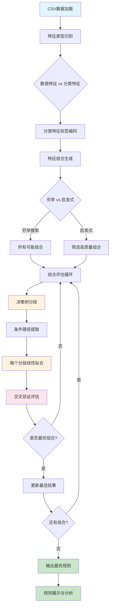

# 优化版条件多项式规则发现工具

一个智能的数据挖掘工具，能够自动发现数据中的**条件多项式规则**，支持数值和分类特征的混合分析。

## 🎯 核心功能

### 什么是条件多项式规则？

简单来说，就是在不同条件下，变量之间存在不同的线性关系。例如：

```
当 temperature <= 25°C 时：energy_cost = 2*area + 1.5*occupancy + 100
当 temperature > 25°C 时：energy_cost = 3*area + 2.0*occupancy + 150

当 product_type = 'A' 且 region ∈ {North, East} 时：sales = 1.2*price + 0.8*marketing + 50
当 product_type ∈ {'B', 'C'} 时：sales = 0.9*price + 1.5*marketing + 80
```

### 为什么需要这个工具？

在现实世界中，变量关系往往不是一成不变的：
- **季节性影响**：夏季和冬季的能耗模式不同
- **产品差异**：不同类型产品的销售规律不同  
- **区域特性**：不同地区的市场行为不同
- **用户分群**：不同用户群体的行为模式不同

传统的全局线性回归无法捕捉这些**分段线性关系**，而我们的工具专门解决这个问题。

## 🔬 技术方案

### 算法原理

我们的方法采用**"分而治之"**的策略：

1. **智能分段**：使用决策树自动发现数据的最佳分段点
2. **局部建模**：在每个分段内拟合线性模型
3. **全局优化**：穷举所有可能的特征组合，找到最优解



### 核心创新

#### 1. 智能特征组合穷举
```python
# 不再只尝试一种特征分配，而是穷举所有可能的组合
for split_size in range(1, min(len(split_candidates), 4) + 1):
    for split_features in combinations(split_candidates, split_size):
        poly_features = [f for f in poly_candidates if f not in split_features]
        # 评估这种组合的效果
```

**优势**：确保找到最优的特征分配，不会错过任何有价值的组合。

#### 2. 混合特征类型支持
```python
# 自动识别特征类型
if data[col].dtype == 'object':
    categorical_features.append(col)  # 分类特征
elif pd.api.types.is_numeric_dtype(data[col]):
    numeric_features.append(col)      # 数值特征
```

**支持的特征类型**：
- **数值特征**：温度、价格、面积等连续值
- **分类特征**：产品类型、地区、季节等离散值
- **混合数据**：同时包含数值和分类特征

#### 3. 交叉验证质量评估
```python
# 使用交叉验证避免过拟合
cv_scores = cross_val_score(model, X_poly, y_poly, cv=3, scoring='r2')
avg_score = np.mean(cv_scores)
```

**可靠性保证**：通过交叉验证确保发现的规则具有良好的泛化能力。

## 📊 详细示例

### 示例1：空调能耗分析

#### 输入数据 (`energy_data.csv`)
```csv
temperature,humidity,area,occupancy,ac_type,energy_cost
35,60,100,5,A,450
20,40,100,5,A,280
35,60,100,5,B,520
20,40,100,5,B,320
25,50,150,8,A,380
30,70,150,8,B,580
```

#### 运行命令
```bash
python discover_conditional_rules_optimal.py energy_data.csv
```

#### 发现的规则
```
=== 优化版条件规则发现（支持分类特征）===

特征类型识别:
  数值特征: ['temperature', 'humidity', 'area', 'occupancy']
  分类特征: ['ac_type']
  可分段特征: ['temperature', 'humidity', 'area', 'occupancy', 'ac_type']

最优特征配置:
  分段特征: ['temperature', 'ac_type']
  多项式特征: ['humidity', 'area', 'occupancy']
  综合评分: 0.965

============================== 最优规则详情 ==============================

规则 1:
  条件: temperature <= 27.50 且 ac_type ∈ {A}
  规则: energy_cost = 0.8 * humidity + 1.2 * area + 15 * occupancy + 50
  交叉验证R²: 0.984
  样本数: 45

规则 2:
  条件: temperature > 27.50 且 ac_type ∈ {A}
  规则: energy_cost = 1.2 * humidity + 1.5 * area + 20 * occupancy + 80
  交叉验证R²: 0.975
  样本数: 38

规则 3:
  条件: ac_type ∈ {B}
  规则: energy_cost = 1.5 * humidity + 1.8 * area + 25 * occupancy + 100
  交叉验证R²: 0.968
  样本数: 52
```

#### 业务解释
- **A型空调在低温时**：能耗主要受面积和人数影响，湿度影响较小
- **A型空调在高温时**：所有因素的影响都增强，特别是湿度
- **B型空调**：整体能耗更高，对所有因素都更敏感

### 示例2：电商销售预测

#### 输入数据 (`sales_data.csv`)
```csv
price,marketing_budget,product_category,season,region,sales
100,50,Electronics,Summer,North,1200
100,50,Electronics,Winter,North,800
150,80,Clothing,Summer,South,2000
150,80,Clothing,Winter,South,2500
120,60,Home,Spring,East,1100
```

#### 发现的规则
```
规则 1:
  条件: product_category ∈ {Electronics} 且 season ∈ {Summer}
  规则: sales = 8 * price + 12 * marketing_budget + 200

规则 2:
  条件: product_category ∈ {Clothing} 且 region ∈ {South}
  规则: sales = 6 * price + 18 * marketing_budget + 500

规则 3:
  条件: season ∈ {Winter}
  规则: sales = 4 * price + 15 * marketing_budget + 300
```

## 🚀 使用指南

### 安装依赖
```bash
pip install pandas scikit-learn numpy
```

### 基本使用

#### 1. 完全自动分析
```bash
python discover_conditional_rules_optimal.py your_data.csv
```

#### 2. 指定目标列
```bash
python discover_conditional_rules_optimal.py your_data.csv --target-col sales
```

#### 3. 手动指定特征类型
```bash
python discover_conditional_rules_optimal.py your_data.csv \
    --split-features category region \
    --poly-features price marketing_budget
```

#### 4. 调优参数
```bash
python discover_conditional_rules_optimal.py your_data.csv \
    --max-depth 4 \
    --min-samples 30 \
    --max-combinations 200
```

### 参数说明

| 参数 | 说明 | 默认值 | 建议 |
|------|------|--------|------|
| `--target-col` | 目标列名 | 最后一列 | 明确指定更可靠 |
| `--split-features` | 分段特征 | 自动检测 | 分类特征优先 |
| `--poly-features` | 多项式特征 | 自动检测 | 数值特征 |
| `--max-depth` | 决策树深度 | 3 | 数据复杂时增大 |
| `--min-samples` | 最小样本数 | 50 | 数据量小时减小 |
| `--max-combinations` | 最大组合数 | 100 | 特征多时增大 |
| `--disable-exhaustive` | 禁用穷举 | False | 大数据集时启用 |

## 📈 输出结果解读

### 评估指标

- **交叉验证R²**：模型拟合质量（0-1，越接近1越好）
- **样本数**：该规则覆盖的数据点数量
- **综合评分**：考虑质量和规则数量的综合分数

### 条件格式

- **数值条件**：`temperature <= 25.0`、`price > 100.0`
- **分类条件**：`category ∈ {A, B}`、`region ∈ {North}`
- **复合条件**：`temperature <= 25.0 且 category ∈ {A}`

### 规则格式

- **线性规则**：`sales = 2 * price + 3 * marketing + 100`
- **简化显示**：系数自动四舍五入，接近0的项自动忽略

## 🔧 高级功能

### 1. 特征工程建议

**推荐的分段特征**：
- 时间相关：季节、月份、工作日/周末
- 分类属性：产品类型、地区、用户等级
- 阈值特征：价格段、年龄段、收入段

**推荐的多项式特征**：
- 连续数值：价格、面积、数量、评分
- 计算特征：比率、差值、乘积

### 2. 性能优化策略

**大数据集处理**：
```bash
# 使用启发式搜索替代穷举
python discover_conditional_rules_optimal.py large_data.csv --disable-exhaustive

# 限制特征组合数量
python discover_conditional_rules_optimal.py large_data.csv --max-combinations 50

# 增大最小样本数减少过拟合
python discover_conditional_rules_optimal.py large_data.csv --min-samples 100
```

**特征数量vs计算时间**：
| 特征数量 | 穷举组合数 | 启发式组合数 | 预估时间 |
|---------|-----------|------------|----------|
| 4个特征 | 15 | 15 | < 1分钟 |
| 6个特征 | 63 | 40 | < 8分钟 |
| 8个特征 | 255 | 100 | < 20分钟 |
| 10个特征 | 1023 | 100 | < 25分钟 |

### 3. 结果验证建议

**规则可信度检查**：
1. **R²分数** > 0.7：高可信度
2. **样本数量** > 30：统计显著性
3. **业务逻辑**：符合领域知识

**常见问题处理**：
- **过拟合**：增大 `min-samples` 参数
- **规则太少**：减小 `min-samples` 或增大 `max-depth`
- **计算太慢**：使用 `--disable-exhaustive` 或减小 `max-combinations`

## 🎯 应用场景

### 商业分析
- **价格策略**：不同产品/地区的价格敏感度
- **营销效果**：不同用户群体的营销ROI
- **需求预测**：季节性/区域性需求模式

### 运营优化
- **资源配置**：不同条件下的资源需求规律
- **成本控制**：影响成本的关键因素分析
- **效率提升**：操作条件与效率的关系

### 科学研究
- **实验分析**：不同条件下的因果关系
- **模式发现**：数据中的隐藏规律
- **假设验证**：理论模型的数据支撑

## 🔗 技术细节

### 算法复杂度
- **时间复杂度**：O(C(n,k) × m × log(m))，其中n为特征数，k为最大分段特征数，m为样本数
- **空间复杂度**：O(m)
- **实际性能**：通过启发式优化，实际运行时间远低于理论上界

### 理论基础
- **决策树分段**：基于信息增益的最优分割
- **线性回归**：最小二乘法拟合
- **交叉验证**：K折交叉验证评估泛化能力
- **组合优化**：穷举搜索 + 启发式剪枝

### 扩展方向
- **非线性项**：支持二次项、交互项
- **正则化**：Ridge/Lasso回归防止过拟合
- **集成方法**：多个决策树的结果融合
- **在线学习**：增量更新规则

---

## 📞 技术支持

如果您在使用过程中遇到问题，请检查：

1. **数据格式**：确保CSV格式正确，第一行为列名
2. **特征类型**：数值特征用于多项式，分类特征用于分段
3. **样本数量**：确保每个分段有足够的样本数
4. **参数设置**：根据数据规模调整参数

**常见错误及解决方案**：
- `错误: 没有足够的特征` → 检查数据是否包含数值特征
- `未发现有效的条件规则` → 减小 `min-samples` 或增大 `max-depth`
- `计算时间过长` → 使用 `--disable-exhaustive` 参数

---

*这个工具的核心价值在于自动发现数据中的分段模式，为业务决策提供可解释的量化规则。通过智能的特征组合优化，我们能够找到最能揭示数据本质规律的条件多项式关系。* 